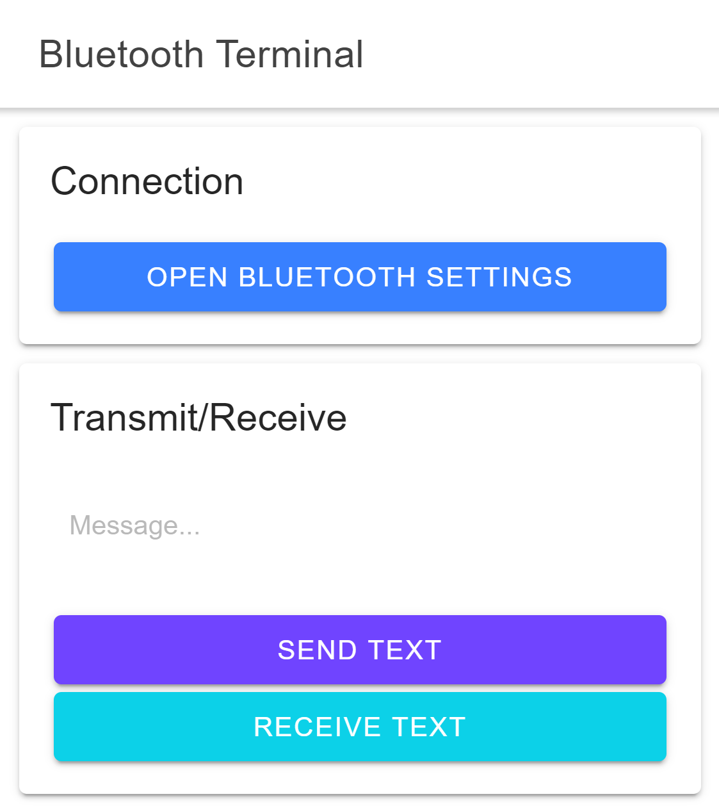

# Bluetooth Terminal



## Introduction
This app facilitates the sending and receiving of serial messages to and from Bluetooth Serial devices, such as Arduinos. Though not yet tested, it should also theoretically be able to send and receive to and from Android/iOS devices.

## Building from Source
1. Install dependencies:
```bash
npm install
```

2. Serve the app:
```bash
ionic serve
```