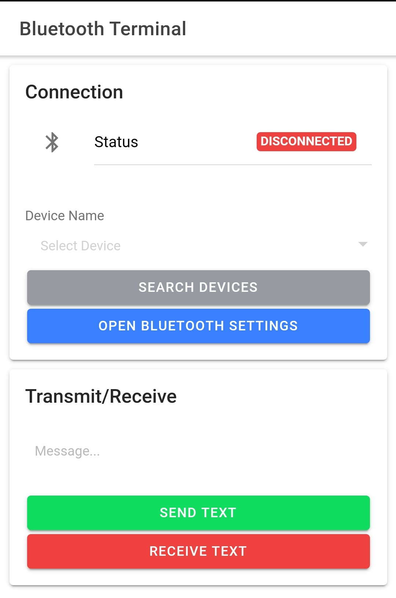

# Bluetooth Terminal



## Introduction

This app facilitates the sending and receiving of serial messages to and from Bluetooth Serial devices, such as Arduinos. Though not yet tested, it should also theoretically be able to send and receive to and from Android/iOS devices.

## Building from Source

1. Install dependencies:

```bash
npm install
```

2. Make sure your device is connected to `adb` and on the same network:
```bash
adb devices
```

2. Serve the app:

```bash
ionic cordova run android -l --ssl
```

## Cordova Plugins

This app uses the following Cordova plugins:

- [Bluetooth Serial](https://github.com/don/BluetoothSerial)
- [Device](https://github.com/apache/cordova-plugin-device)
